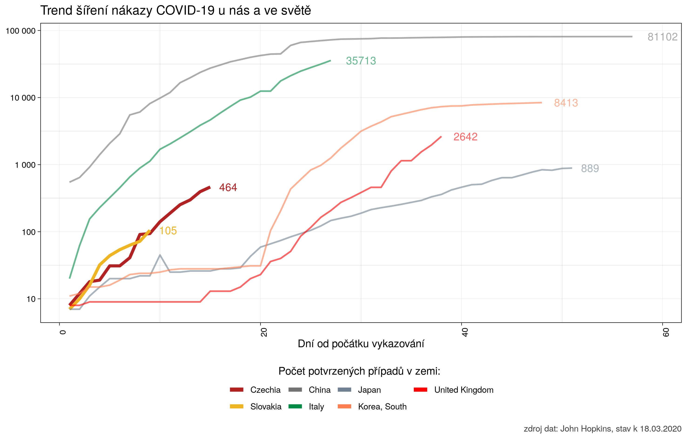

# Koronavirus

Grafické zobrazení vývoje nového ḱoronaviru COVID-19, ze zvláštním zřetelem na Českou republiku.

Zdrojem dat je známá databáze od John Hopkins univerzity, k dispozici zde na GitHubu:  https://github.com/CSSEGISandData/COVID-19

  

Aktuální trend se dost blíží ideální exponenciále, s vyhlídkou 10 tisíc případů před koncem března.

Pro srovnání trend čtyř zemí ve světě; je vidět jak se exponenciálu podařilo zastavit v Číně a Koreji, zpomalit v Japonsku ale v Itálii stále drží trend.

  

