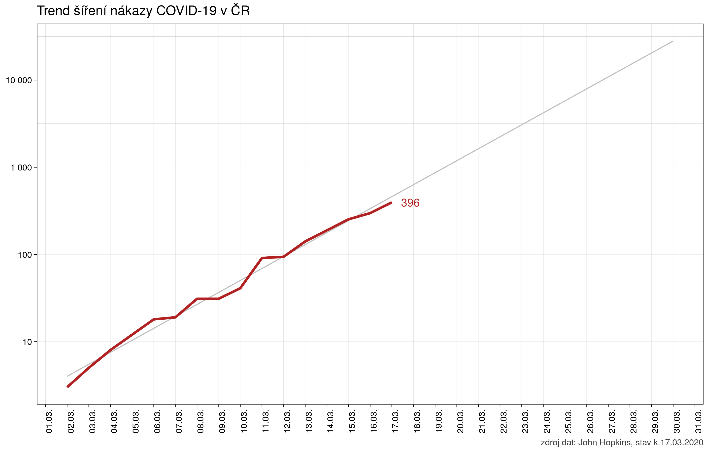

# Korunavirus

Grafické zobrazení vývoje nového ḱoronaviru COVID-19, ze zvláštním zřetelem na Českou republiku.

Zdrojem dat je známá databáze od John Hopkins univerzity, k dispozici zde na GitHubu:  https://github.com/CSSEGISandData/COVID-19

Aktualizace je dočasně nastavená na ruční zkopírování dat z repa do repa (s výhledem na optimalizaci).

  

